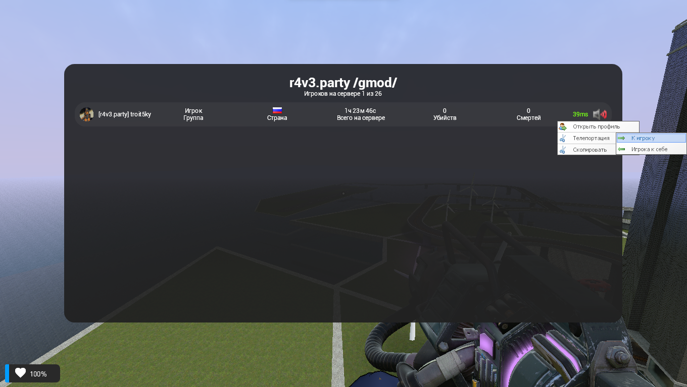

# gmod_scoreboard

Simple scoreboard for your server.

## Dependencies

- [PIXEL-UI](https://github.com/TomDotBat/pixel-ui)
- [UTime (Be1zebub
/
utime recommended)](https://github.com/Be1zebub/utime)

### Installation guide
Download the addon and unpack to `garrysmod/addons`.

## Preview

